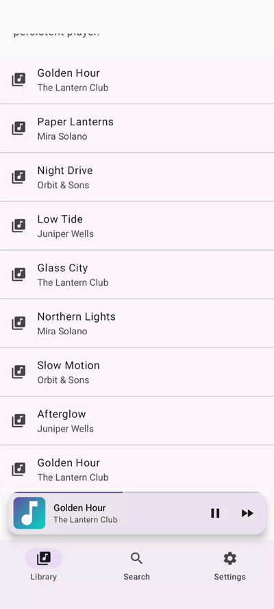
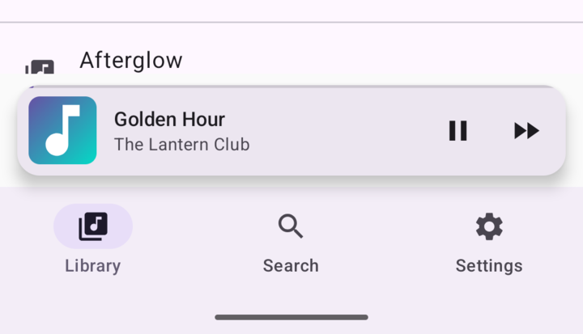
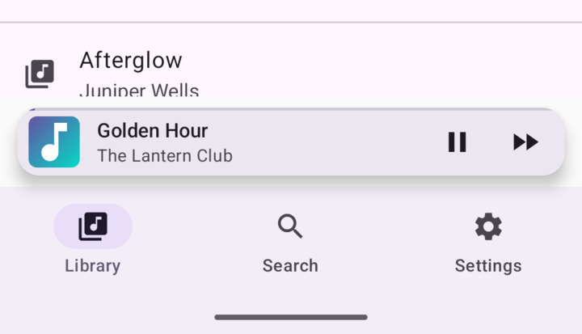
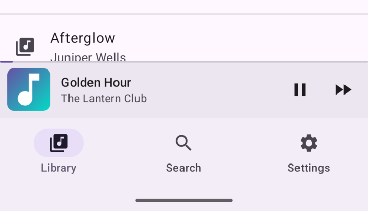
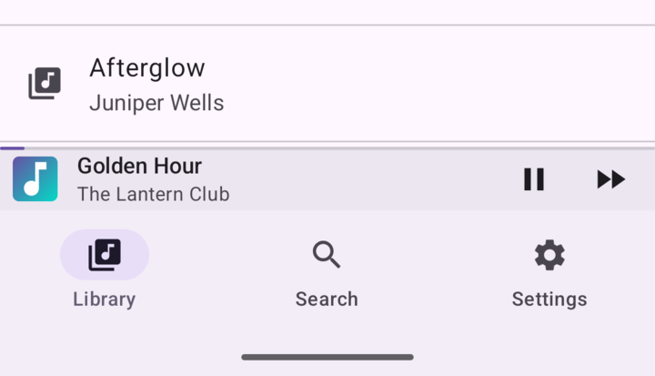

<p align="center">
  
</p>

<h1 align="center">compose-popupbar</h1>

<p align="center">
  <a href="https://github.com/fethica/compose-popupbar/actions/workflows/ci.yml"></a>
  <a href="https://jitpack.io/#fethica/compose-popupbar"></a>
  
  <a href="LICENSE"></a>
</p>

A media-agnostic popup bar for Jetpack Compose. It keeps a compact bar docked above your bottom navigation and morphs it into full-screen content through an interactive, interruptible transition. Inspired by, and gratefully crediting, [LNPopupController](https://github.com/LeoNatan/LNPopupController): the library owns presentation and gestures while your app supplies all content, artwork, progress, and actions.

<p align="center">
  
</p>

## Features

- Interactive, interruptible bar-to-fullscreen morph that follows the finger
- Four bar styles (floating, floating compact, prominent, compact) and four interaction styles
- Shared artwork that travels between the bar thumbnail and the expanded content
- Optional progress strip with drag-to-seek on the bar's hairline
- Suspending state API: `present()`, `expand()`, `collapse()`, `hide()`, with continuous `progress` and `presentation` fractions
- Accessibility built in: one merged bar node, hidden background content behind the expanded popup, localized close controls
- Full RTL mirroring, verified with the sample app's live RTL and dark-theme toggles

## Bar styles

Four `PopupBarStyle` values, all docked above the same bottom navigation. Pick one on `PopupHost`; the morph and the gestures stay the same.

| Floating (default) | Floating compact |
| --- | --- |
|  |  |
| **Prominent** | **Compact** |
|  |  |

## Install

```kotlin
// settings.gradle.kts
dependencyResolutionManagement {
    repositories {
        maven("https://jitpack.io")
    }
}

// build.gradle.kts
dependencies {
    implementation("com.github.fethica.compose-popupbar:popupbar:0.1.0")
}
```

## Usage

```kotlin
@Composable
fun PlayerScreen() {
    val popupState = rememberPopupState(PopupValue.Collapsed)

    MaterialTheme {
        PopupHost(
            state = popupState,
            bottomBar = {
                NavigationBar {
                    // NavigationBarItem(...)
                }
            },
            popupBar = {
                PopupBar(
                    title = "Title",
                    subtitle = "Subtitle",
                )
            },
            popupContent = {
                Box(Modifier.fillMaxSize()) {
                    // Full-screen player content
                }
            },
        ) { padding ->
            Box(Modifier.fillMaxSize().padding(padding)) {
                // App screen content
            }
        }
    }
}
```

The bar expands the popup when tapped. Call the state methods from your own UI or app state to present, expand, collapse, or hide it.

Option matrix, state API, insets and content design, shared artwork, and the composite-build setup are in [DOCUMENTATION.md](DOCUMENTATION.md).

## Requirements

- Android 7.0+ (API 24)
- Compose BOM 2026.01.01

## Not yet

- Paging to previous or next popup items.
- Built-in blurred or translucent popup backgrounds.

## License

MIT. See [LICENSE](LICENSE).
