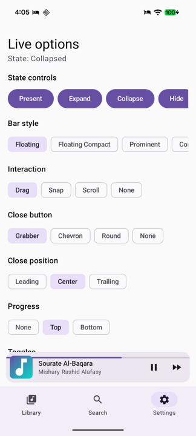
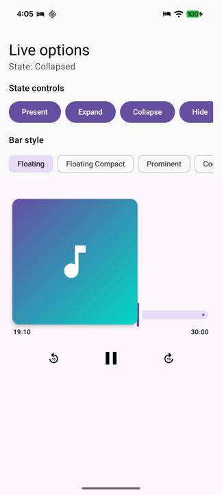
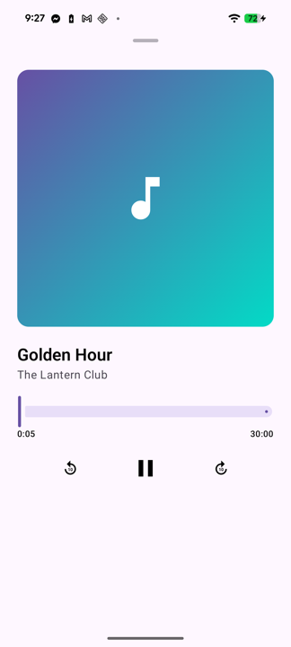

# compose-popupbar

`compose-popupbar` is a media-agnostic popup bar for Jetpack Compose: it keeps a compact bar docked above your bottom navigation and morphs it into full-screen content through an interactive, interruptible transition. It is inspired by and gratefully credits [LNPopupController](https://github.com/LeoNatan/LNPopupController); the Android library owns presentation and gestures while your app supplies all content, artwork, progress, and actions.

| Collapsed | Mid-morph | Expanded |
| --- | --- | --- |
|  |  |  |

## Install from JitPack

Add JitPack to dependency resolution in `settings.gradle.kts`:

```kotlin
dependencyResolutionManagement {
    repositories {
        google()
        mavenCentral()
        maven { url = uri("https://jitpack.io") }
    }
}
```

Then add the library to the app module:

```kotlin
dependencies {
    implementation("com.github.fethica.compose-popupbar:popupbar:0.1.0")
}
```

## Use a composite build locally

Keep this repository beside your app and conditionally include it from the app's `settings.gradle.kts`:

```kotlin
val popupBarCheckout = file("../compose-popupbar")
if (popupBarCheckout.exists()) {
    includeBuild(popupBarCheckout)
}
```

Keep the same published coordinate in the app module:

```kotlin
implementation("com.github.fethica.compose-popupbar:popupbar:0.1.0")
```

Gradle substitutes the included `:popupbar` project for that coordinate, so local and published builds use the same app code.

## Minimal usage

```kotlin
@Composable
fun PlayerScreen() {
    val popupState = rememberPopupState(PopupValue.Collapsed)

    MaterialTheme {
        PopupHost(
            state = popupState,
            bottomBar = {
                NavigationBar {
                    // NavigationBarItem(...)
                }
            },
            popupBar = {
                PopupBar(
                    title = "Title",
                    subtitle = "Subtitle",
                )
            },
            popupContent = {
                Box(Modifier.fillMaxSize()) {
                    // Full-screen player content
                }
            },
        ) { padding ->
            Box(Modifier.fillMaxSize().padding(padding)) {
                // App screen content
            }
        }
    }
}
```

The bar itself expands the popup when tapped. Call the state methods from your own UI or app state to present, expand, collapse, or hide it.

## Option matrix

| Option | Value | Effect |
| --- | --- | --- |
| `PopupBarStyle` | `Floating` | 64 dp rounded card with horizontal and bottom margins. |
| `PopupBarStyle` | `FloatingCompact` | Shorter 48 dp floating card. |
| `PopupBarStyle` | `Prominent` | 64 dp edge-to-edge bar flush with the docking bar. |
| `PopupBarStyle` | `Compact` | 40 dp edge-to-edge bar with compact artwork. |
| `PopupInteractionStyle` | `Drag` | The bar and expanded content continuously follow a vertical drag. |
| `PopupInteractionStyle` | `Snap` | Commits after the distance or velocity threshold, then animates to an anchor. |
| `PopupInteractionStyle` | `Scroll` | Adds nested-scroll handoff for long popup content. |
| `PopupInteractionStyle` | `None` | Disables swipes; bar taps, close controls, and state methods still work. |
| `PopupCloseButtonStyle` | `Grabber` | Wide, accessible drag-handle collapse target. |
| `PopupCloseButtonStyle` | `Chevron` | Down-chevron icon button. |
| `PopupCloseButtonStyle` | `Round` | Filled tonal circular close button. |
| `PopupCloseButtonStyle` | `None` | Draws no close control. |
| `PopupCloseButtonPosition` | `Leading` | Places the close control at logical start. |
| `PopupCloseButtonPosition` | `Center` | Centers the close control. |
| `PopupCloseButtonPosition` | `Trailing` | Places the close control at logical end. |
| `PopupProgressStyle` | `None` | Draws no bar progress strip. |
| `PopupProgressStyle` | `Top` | Draws the progress strip along the bar's top edge. |
| `PopupProgressStyle` | `Bottom` | Draws the progress strip along the bar's bottom edge. |

`PopupHost` also accepts an optional scrim color and haptics toggle. `PopupBar` accepts optional progress, seeking, action slots, colors, text styles, marquee configuration, and an accessibility-description override.

## State API

| Member | Meaning |
| --- | --- |
| `present()` | Animate from `Hidden` to `Collapsed`; otherwise no-op. |
| `expand()` | Present if necessary, then animate to `Expanded`. |
| `collapse()` | Animate to `Collapsed`; no-op while hidden. |
| `hide()` | Collapse if necessary, then animate out to `Hidden`. |
| `snapTo(value)` | Move immediately to `Hidden`, `Collapsed`, or `Expanded`. |
| `currentValue` | Last settled `PopupValue`. |
| `targetValue` | Destination of the current gesture or animation. |
| `progress` | Continuous expansion fraction: `0f` collapsed, `1f` expanded. |
| `presentation` | Continuous visibility fraction: `0f` hidden, `1f` presented. |
| `isHidden`, `isCollapsed`, `isExpanded` | Convenient settled-state flags. |
| `isAnimationRunning` | Whether presentation or expansion is animating. |

All transitions are suspending and respect the `confirmValueChange` callback passed to `rememberPopupState`.

## Designing the content

Popup content is measured at the full host size throughout the morph, so it does not reflow while dragging. Apply `statusBarsPadding()` to your content, and leave about 48 dp at the top for the host's close affordance.

When using shared artwork, pass one composable through `popupImage` and reserve its expanded destination exactly once:

```kotlin
PopupHost(
    state = popupState,
    popupImage = { AlbumArtwork() },
    popupBar = { PopupBar(title = "Title") },
    popupContent = {
        Column(Modifier.fillMaxSize().statusBarsPadding().padding(24.dp)) {
            Spacer(Modifier.height(48.dp))
            PopupImageSlot(
                modifier = Modifier.fillMaxWidth().aspectRatio(1f),
                shape = RoundedCornerShape(16.dp),
            )
            // Player controls
        }
    },
) { padding -> AppContent(Modifier.padding(padding)) }
```

The host keeps that artwork composable alive and moves it between the bar thumbnail and content slot. For lyrics, queues, or other long content, use `PopupInteractionStyle.Scroll` with a nested-scroll child such as `LazyColumn`.

## Accessibility and RTL

The collapsed bar exposes one merged button node with a default description of `"title, subtitle"`, an expand action, and progress semantics when progress is supplied. Collapsed popup content is hidden from accessibility services, while close controls use localized library strings in English, French, and Arabic.

Layout uses logical start/end positions. Leading and trailing controls mirror in RTL, and the seekable progress strip reverses its fill and touch mapping. The sample app has live RTL and dark-theme toggles for verification.

## Not yet

- Paging to previous or next popup items.
- Built-in blurred or translucent popup backgrounds.

## License

MIT. See [LICENSE](LICENSE).
